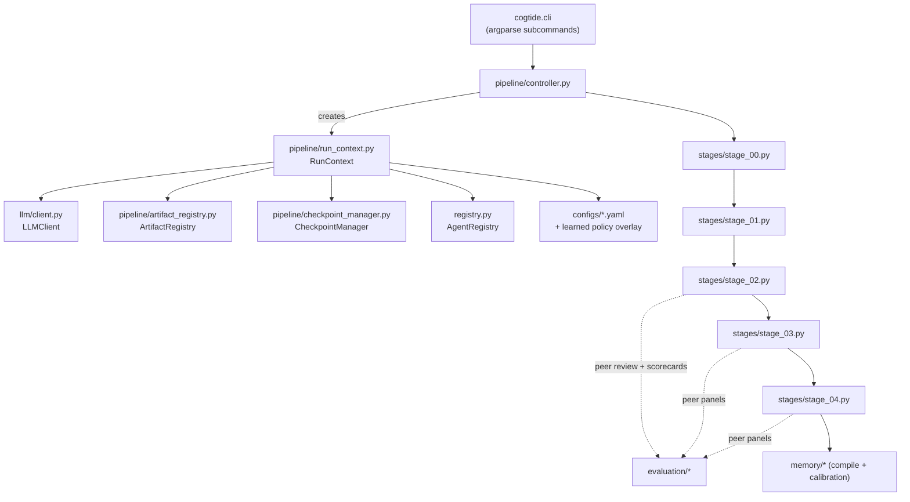
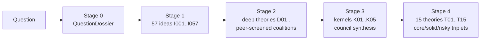
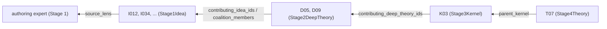

# How CogTIDE Works — a technical deep-dive

This document is for contributors and reviewers who want to understand the
internals of **cogTIDE** (Cognitive Theory Ideation, Debate, and Epistemic
Evaluation). Every claim below is grounded in the source tree under
`cogtide/`. Module paths are given so you can read along.

> cogTIDE turns an open-ended research question into scientific-theory
> candidates through a five-stage, audit-first LLM pipeline. Its
> distinguishing property is that *promotions between stages are governed by
> outsider peer review, forecast skill, and downstream survival — not by
> synthesis fluency*. Everything a stage produces is a canonical, typed,
> traceable artifact on disk.

**Responsible-use note.** Everything cogTIDE emits is a *hypothesis for expert
review*, not a validated scientific result. The peer-prediction machinery
described here is a heuristic elicitation layer, not a proof of correctness.
See [§9 Limitations & threats to validity](#9-limitations--threats-to-validity).

---

## Table of contents

1. [Architecture overview](#1-architecture-overview)
2. [The stages in detail (0–4)](#2-the-stages-in-detail-04)
3. [The scoring model](#3-the-scoring-model)
4. [Reviewer calibration](#4-reviewer-calibration)
5. [The memory subsystem](#5-the-memory-subsystem)
6. [Traceability & artifact lineage](#6-traceability--artifact-lineage)
7. [Configuration surface](#7-configuration-surface)
8. [Extensibility](#8-extensibility)
9. [Limitations & threats to validity](#9-limitations--threats-to-validity)

---

## 1. Architecture overview

The pipeline is a chain of asynchronous stage drivers threaded through a single
`RunContext`. The controller sequences the stages; the stages call the LLM
through one client, canonicalize the output into Pydantic models, and write
canonical artifacts to a per-run directory.



### 1.1 `RunContext` (`cogtide/pipeline/run_context.py`)

`RunContext` is a `@dataclass` created once per run and passed to every stage.
It owns the run directory and the shared services:

- `run_id`, `run_dir` — the run identity and its output tree under `runs/`.
- `client: LLMClient` — the single async LLM client (`§1.4`).
- `checkpoint: CheckpointManager`, `artifacts: ArtifactRegistry` — the
  audit/resume infrastructure (`§1.5`).
- `agents: AgentRegistry` — the loaded `configs/agents.yaml` (`§1.3`).
- `config: dict` — the merged configuration (`§7`).

`RunContext.create(topic, ...)` (lines ~105–197) is the bootstrap:

1. `_load_env_file()` — a best-effort `.env` loader that reads the repo-root
   `.env` with `utf-8-sig` (tolerates BOMs), skips obvious placeholder values
   (`sk-replace-me`, `your-key-here`, …), and uses `os.environ.setdefault` so
   real shell exports always win over file entries.
2. Loads `configs/models.yaml`, `configs/retries.yaml`, `configs/pipeline.yaml`
   into `ModelConfig` / `RetryConfig` / a plain `pipeline_data` dict.
3. Builds the effective config: `_deep_merge(model_data, pipeline_data)`, then
   `apply_policy_overlay(...)` merges the allow-listed learned policy overlay
   (`§5.4`), then any explicit `config_overrides`.
4. Creates `runs/<run_id>/`, writes `run_meta.json`
   (`run_id`, `topic`, `model`, full `config`).
5. Instantiates `LLMClient`, `CheckpointManager`, `ArtifactRegistry`,
   `AgentRegistry.load()`.

`RunContext.resume(run_id)` reads `run_meta.json`, extracts the topic, and
re-runs `create` with the same `run_id` (so config is re-derived, not frozen).
`stage_dir(stage)` returns (and `mkdir`s) `runs/<run_id>/<stage>/`.

Note the two roots resolved from the file location:
`RUNS_ROOT = <repo>/runs` and `CONFIGS_ROOT = <repo>/configs`. Prompts,
configs, and schemas are all loaded relative to the repo root, which is why an
**editable install from a clone** (`pip install -e .`) is the supported path.

### 1.2 The controller (`cogtide/pipeline/controller.py`)

The controller is a thin sequencer plus a set of resume-helpers. It has no LLM
logic of its own — stages are imported lazily inside functions to keep the
import graph flat.

- `run_full_pipeline(ctx, topic, non_interactive)` — end-to-end driver:
  `drive_stage_00` → `drive_stage_01` → `run_pipeline`.
- `run_pipeline(ctx, dossier, idea_set)` — the peer-prediction core, Stage 2
  → Stage 4 plus the calibration/memory loop (see below). Assumes Stage 0/1
  are done.
- `drive_stage_00` / `drive_stage_01` — pass-throughs to the stage modules.
- `load_*_from_run(ctx)` — resume helpers that glob canonical artifacts off
  disk (e.g. `stage_00/question-*.json`, `stage_01/raw-ideas-*.json`,
  `stage_02/coalition-deep-theories-*.json`, …) and re-validate them into
  their Pydantic models.

The **calibration flow inside `run_pipeline`** is the load-bearing part:

1. Load the cross-run calibration aggregate
   (`load_calibration_aggregate()` → `ReviewerCalibrationRecord`s) and turn it
   into `historical_weights` via `compute_calibration_weights`.
2. Run Stage 2 with `calibration_weights=historical_weights`.
3. Build within-run calibration records from the Stage 2 idea peer reviews,
   using the *survived set* = union of `contributing_idea_ids` across accepted
   deep theories (`build_calibration_records`). Fold in the Stage 2 external
   panels (`external-panel-reviews-D*.json`) via `update_within_run_calibration`.
4. Recompute weights and run Stage 3 with them.
5. Fold in the Stage 3 external panels (`external-panel-reviews-K*.json`).
6. Run Stage 4 (it does **not** consume calibration weights — its scoring is
   role-assignment, not weighted quality; see `§2.5`).
7. Post-pipeline: `summarize_calibration_for_memory`, save per-run calibration
   (`save_calibration_records`), merge into the aggregate
   (`save_calibration_aggregate`), compile run memory (`compile_run_memory`),
   and optionally compress memory (`examine_and_compress_memory`).

### 1.3 `AgentRegistry` (`cogtide/registry.py`)

`AgentRegistry.load()` parses `configs/agents.yaml` into a list of `AgentSpec`
dataclasses (`id`, `stage`, `substage`, `prompt`, `role`, `output_schema`,
optional `model`/`temperature`/`preservation_oriented`, and an `extra` dict for
anything else — e.g. `expert_index`, `domain`). Unknown YAML keys are captured
into `extra` rather than dropped. Lookups: `get(id)`, `for_stage(stage)`,
`for_substage(stage, substage)`, `all()`. Stage 1 uses
`for_substage("stage_01", "S01.03")` and sorts by `extra["expert_index"]`.

### 1.4 `LLMClient` (`cogtide/llm/client.py`)

A single async client over any OpenAI-compatible chat-completions endpoint
(via `openai.AsyncOpenAI`). Configured by `ModelConfig` (provider,
`api_base_url`, `api_key_env`/`fallback_api_key_env`, `model`, `temperature`,
`max_tokens`, `response_format_json`) and `RetryConfig`.

Rate-limit hardening has three layers:

1. **Bounded concurrency** — `asyncio.Semaphore(concurrency_limit)`.
2. **Global token bucket** (`_RateLimiter`) — enforces a minimum wall-clock
   gap (`min_request_interval_seconds`) between *all* requests, giving an RPM
   ceiling even when concurrency > 1.
3. **429-aware backoff** — the retry loop detects rate-limit errors
   (`RateLimitError`, `"429"`, some providers' proprietary codes like `1302`,
   `"rate limit"`), honors a `Retry-After` header as a floor, multiplies the
   base wait by `rate_limit_backoff_multiplier`, and applies uniform
   `retry_jitter` so concurrent failures don't retry in lockstep.

Key methods:

- `chat(...)` → a `CallRecord` (the full audit unit: prompts, raw response,
  attempts used, `finish_reason`, `last_error`, and a `was_truncated` property
  that treats `"length"`/`"max_tokens"` finish reasons as truncation).
- `chat_json(...)` → `(parsed, CallRecord)`; runs `extract_json` and attaches
  the `NormalizationReport` to the record.
- `gather_with_limit(coros, max_concurrency=...)` — a helper for fan-out with a
  secondary semaphore (used by the peer-review fan-outs).

Supporting `llm/` modules:

- `normalization.py` — `extract_json(text, expect=...)` strips markdown
  fences, tries `json.loads`, falls back to a regex extract, and unwraps
  wrapper objects. `WRAPPER_KEYS` handles array payloads (e.g.
  `{"ideas": [...]}`), `OBJECT_WRAPPER_KEYS` handles single-object payloads
  (e.g. `{"deep_theory": {...}}`). Everything is recorded in a
  `NormalizationReport` so each parse is auditable. Also exposes coercers
  (`ensure_list`, `safe_str`, `coerce_string_field`, `coerce_list_field`) used
  by the models.
- `canonicalization.py` — the alias-rescue layer. LLMs drift toward field
  names they've recently seen; `canonicalize(raw, aliases=..., required=...)`
  maps known aliases back to canonical names (first non-empty alias wins),
  unwraps envelope keys, and reports missing/blank required fields. Per-stage
  alias/required tables (`STAGE1_IDEA_ALIASES`, `STAGE2_DEEP_THEORY_ALIASES`,
  `PEER_REVIEW_ALIASES`, `JUDGE_VERDICT_ALIASES`, …) live here.
- `retry_wrapper.py` — `call_json_with_retry(...)`: structured-call retry with
  *pointed correction*. On failure it re-sends the payload with
  `previous_failure_reasons` and explicit instructions ("re-emit a single JSON
  object with canonical field names; do not wrap in an envelope"), then
  canonicalizes and checks required fields.
- `prompt_builder.py` — loads markdown prompts from `prompts/` and substitutes
  `{{ key }}` placeholders. `compose_with_shared(relative_path, shared,
  context, *, stage_base)` composes `prompts/shared/BASE_*.md` + an optional
  per-stage base + the per-agent prompt, joined by `\n\n---\n\n`. `stage_base`
  is **keyword-only and required** on purpose (a prior codebase silently
  dropped stage bases when it had a default).
- `chunking.py` — `chunk_list`, `build_focus_batches` (seeded shuffle +
  round-robin), and compact formatters used to keep batch prompts small.

### 1.5 `ArtifactRegistry` and `CheckpointManager`

Both are instantiated in `RunContext.create` and define the audit/resume
schema:

- `ArtifactRegistry` (`pipeline/artifact_registry.py`) — an append-only
  `runs/<run_id>/artifacts.json`; `add(...)` writes an `ArtifactRecord`
  (`artifact_id`, `path`, `stage`, `substage`, `schema_type`,
  `parent_artifact_ids`, `producing_agent`, `validation_status`, `timestamp`).
  The file is initialized to `[]` at bootstrap.
- `CheckpointManager` (`pipeline/checkpoint_manager.py`) — writes a
  `SubstageManifest` per substage to `runs/<run_id>/manifests/<stage>_<substage>.json`
  and supports manifest-based resume (`is_complete`, `latest_complete_substage`
  skip substages whose `validation_status == "passed"`).

**Important accuracy note for contributors.** These two components provide the
manifest/artifact-record *schema and API* and are wired into `RunContext`, but
the shipped stage drivers currently persist their **canonical stage artifacts
directly** via `cogtide/utils/io.write_json` (e.g.
`stage_02/coalition-deep-theories-<run_id>.json`) and **resume by globbing
those canonical files** (the controller's `load_*_from_run` helpers), not by
replaying manifests. In other words, `run_meta.json` and an initialized
(empty) `artifacts.json` are always present, and the per-substage manifest
machinery exists, but the primary resume path today is "load the canonical
artifact if it exists." This is the honest current state; wiring
`ctx.artifacts.add(...)` / `ctx.checkpoint.write(...)` into every substage is a
natural extension (see `§8`).

---

## 2. The stages in detail (0–4)

Each stage produces exactly one canonical artifact (plus side artifacts). The
canonical filenames are what the controller globs on resume. All prompts are
composed from `prompts/shared/BASE_*.md` bases plus a per-stage base plus the
per-agent prompt.

Shared bases (`prompts/shared/`): `BASE_reasoning.md`, `BASE_json_contract.md`,
`BASE_output_contract.md`, `BASE_preservation.md`, `BASE_traceability.md`.
`BASE_traceability.md` tells agents to reference prior artifacts by stable ID
(`I012`, `D03`, `K05`, `T07`) and populate `contributing_*` fields;
`BASE_preservation.md` defines the `UNIQUE`/`RISKY`/`SPECIAL` discipline.



### 2.0 Stage 0 — Question clarification (`stages/stage_00.py`)

**Input:** a raw `topic` string. **Output:** `stage_00/question-<slug>-<ts>.json`
and `.md`, a `QuestionDossier` (`models/question_dossier.py`).

Flow (`run_stage_00`):

1. **Local-materials ingestion.** If no `overview_text` is passed,
   `select_and_ingest_context(topic)` scans the top-level `question/`
   directory for **subfolders** whose names token-overlap the question
   (`score_subfolders_against_topic`). One match → `y/N` confirm; multiple →
   numbered pick; then `read_context_from_folder` concatenates all `.md`/
   `.txt`/`.rst`/`.markdown` files (recursively) up to a 500k-char budget. The
   top-level `overview.md`/`README.md` are deliberately excluded. In
   `--non-interactive` mode the highest-scoring folder is auto-selected.
2. **Prior-run memory.** `retrieve_for_consumer(ctx.config, "stage_00",
   "clarifier", question_keywords=...)` injects non-authoritative memory (`§5`).
3. **Clarifier loop.** The clarifier agent
   (`stage_00/AG_S00_SS04_question_clarifier.md`) is called with a growing
   `transcript`. A three-layer contract prevents premature finalization:
   (a) the prompt requires `{"status": "needs_more_input", ...}` on the first
   call; (b) `_is_dossier_shape` on call 1 is rejected in stage logic;
   (c) the CLI requires the user to type `y`/`yes` to accept the drafted
   dossier — anything else becomes refinement feedback. A hard ceiling
   (`stages.stage_00.max_clarification_rounds`, default 5) bounds total turns.
4. **Long-input escape hatches.** `_prompt_user` supports `:edit` (opens
   `$EDITOR`), `:file <path>`, and `:multi` (multi-line until `:end`) to work
   around the macOS tty 1024-byte canonical-mode limit.

The dossier fields most used downstream: `clarified_question`/`core_question`
(become the Stage 1 question), `background_context`/`consolidated_summary`
(become Stage 1 background and the `dossier_summary` threaded through Stages
2–4).

### 2.1 Stage 1 — Multi-agent ideation (`stages/stage_01.py`)

**Input:** the `QuestionDossier`. **Output:**
`stage_01/raw-ideas-<run_id>.json`, a `Stage1IdeaSet`. Side artifacts:
`stage_01/challenges-round-<N>.json`.

- **19 experts × 3 ideas = 57 raw ideas.** The 19 experts are the
  `S01.03` agents in `configs/agents.yaml`
  (reinforcement_learning, bayesian_inference, control_theory,
  dynamical_systems, information_theory_compression, cognitive_science,
  neuroscience, decision_making, sensory_systems, social_cognition,
  development_learning, motor_control, linguistic_communication, music_rhythm,
  ecological_embodied_cognition, complex_systems, computational_neuroscience,
  machine_learning, mathematics). Experts run **sequentially** (to respect
  rate limits), each asked for exactly 3 ideas in grounded → medium → bold
  order. Each expert prompt is composed with
  `stage_01/BASE_S01_expert_generation.md`.
- **Content-level retry.** `run_expert` retries up to
  `DEFAULT_EXPERT_RETRY_ATTEMPTS` (2); raw dicts are canonicalized through
  `STAGE1_IDEA_ALIASES`/`STAGE1_IDEA_REQUIRED` and validated by
  `Stage1Idea.from_normalized`. The best (largest valid) batch is kept across
  attempts; an idea with any blank critical field is rejected at the model
  boundary (`Stage1Idea` field validators).
- **Challenger pass.** After ideation, `challenger_rounds` (default 2) run over
  chunks of 10 (`stage_01/AG_S01_SS05_challenger.md`), persisting critiques to
  `challenges-round-<N>.json`. **Challenges are informational only in this
  build — they are not back-propagated into idea revisions.**
- IDs are `I{index:03d}` (`utils/ids.idea_id`), so the 57 ideas are
  `I001..I057`. `source_lens` is the expert's `domain`.

### 2.2 Stage 2 — Peer-screened coalition synthesis (`stages/stage_02.py`)

**Input:** the `Stage1IdeaSet` + `dossier_summary`. **Output:**
`stage_02/coalition-deep-theories-<run_id>.json`, a `Stage2DeepTheorySet`
(deep theories `D01..`). Side artifacts: `idea-peer-reviews.json`,
`idea-scorecards.json`, `external-panel-reviews-D*.json`.

Sub-stages (matching the module's `2A`–`2F` comments):

- **2A. Blind peer review** (`run_idea_screening` → `run_idea_peer_review`).
  Each idea is reviewed by `reviewers_per_idea` experts (config default 3;
  code default 5) who did **not** author it (`_select_reviewers` excludes the
  `source_lens`, seeded for determinism). Reviewers rate on `IDEA_DIMENSIONS`
  (`novelty`, `mechanistic_promise`, `coherence`, `distinctiveness`,
  `testability`) and produce peer predictions. Reviewer prompt:
  `stage_02/AG_S02_peer_reviewer.md`. Reviewers never see each other's ratings
  — that independence is what makes the peer-prediction signal informative.
- **2B. Idea scorecards** (`aggregate_idea_scorecards` →
  `compute_idea_scorecards`). One `IdeaScorecard` per idea (`§3`). Under-fill
  (ideas with < `reviewers_per_idea` reviews from API failures) is warned but
  not fatal.
- **2C. Coalition construction** (`select_coalition`). A seeded, deterministic
  greedy selector builds a coalition of `coalition_size` ideas (default 5),
  scoring each idea on a weighted sum of scorecard quality
  (`×0.3`), positive `unexpected_support` (`×0.25`), survival forecast
  (`×5×0.15`), calibration-weighted score (`×0.15`), an under-represented-expert
  bonus, a preservation-mark bonus (`+1.5`), an underrated bonus (`+1.0`), and
  deterministic jitter. Selection prefers lens diversity.
- **2D. Drafter → critic** (`run_coalition_synthesis`). The drafter
  (`stage_02/AG_S02_drafter.md`) synthesizes a candidate deep theory from the
  idea packet (each idea carries its peer scorecard); the critic
  (`stage_02/AG_S02_critic.md`) revises it. Both go through
  `call_json_with_retry` (drafter against `STAGE2_DRAFT_*`, critic against
  `STAGE2_DEEP_THEORY_*`). If the critic fails, the draft is used.
- **2E. External peer panel** (`run_external_panel_on_candidate` →
  `run_theory_peer_panel`). Panelists are experts strictly **excluded** from
  the coalition (if fewer than `external_panel_size` external experts exist, an
  empty scorecard is returned rather than weakening externality). Panel rates
  on `THEORY_DIMENSIONS` (`depth`, `mechanistic_clarity`, `coherence`,
  `distinctiveness`, `testability`, `non_averaging`) via
  `stage_02/AG_S02_external_reviewer.md`. Produces a `DeepTheoryScorecard`.
- **2F. Synthesis judge** (`judge_candidate`, `stage_02/AG_S02_judge.md`).
  The judge sees the candidate + scorecard + coalition members and must return
  an **explicit** acceptance verdict (allow-list `_ACCEPT_TERMS`; ambiguous/
  missing verdicts default to *reject* so the pipeline can never silently
  rubber-stamp). Numerical peer-score gating is **not** done in the judge — it
  is deferred to a post-loop top-K trim.

**Pooling + top-K trim.** The loop runs until the accepted pool reaches
`target × pool_multiplier` (`needed_pool`, default 1.5× target, capped by
`max_attempts`), then trims to the top `target` (default 15) by
`_composite_peer_score` = `calibration_weighted_score` (or `quality_score`)
`+ 0.5 × max(0, unexpected_support)`. Trimmed candidates have their audit
records flipped to rejected with the cutoff recorded. Deep-theory IDs are
`D{counter:02d}`. A `CoalitionAttempt` is logged for every attempt (accepted or
not) so failed coalitions are auditable.

### 2.3 Stage 3 — Council/kernel synthesis (`stages/stage_03.py`)

**Input:** the `Stage2DeepTheorySet` + `dossier_summary`. **Output:**
`stage_03/council-kernels-<run_id>.json` (and `.md`), a `Stage3KernelSet`
(kernels `K01..`). Side artifacts: `external-panel-reviews-K*.json`.

- **3A. Council selection** (`select_council`). Scores each deep theory on
  Stage 2 peer signals (`peer_quality_score ×0.3`, positive
  `peer_unexpected_support ×0.25`, `peer_survival_forecast ×5×0.2`, lineage
  diversity `×0.1`, underrated/preservation/under-used bonuses, jitter), then
  greedily picks `council_theory_size` (default 3) deep theories with limited
  idea-lineage overlap. Council experts = union of the theories' contributing
  experts, filled to `expert_min` and trimmed to `expert_max` (default 5–7).
- **3B. Council discussion** (`run_council_discussion`,
  `stage_03/AG_S03_facilitator.md` + `BASE_S03_council.md`). The facilitator
  searches for a *deeper shared substrate* across the 3 deep theories
  (restatement → bridges → negotiation → shared substrate → attack/defense →
  finalize), returning a kernel candidate via `call_json_with_retry`
  (`STAGE3_KERNEL_*`).
- **3C. External kernel panel** (`run_kernel_peer_panel`). Panel excludes
  council members; rates on `THEORY_DIMENSIONS` via
  `stage_03/AG_S03_external_reviewer.md`; produces a `KernelScorecard`. The
  kernel scorecard adds an `is_locally_persuasive_only` / `is_genuinely_deep`
  flag: it is `True` when more than half the panel marks the kernel
  `overrated` (i.e., persuasive only within its own framing).
- **3D. Kernel judge** (`judge_kernel`, `stage_03/AG_S03_judge.md`). Asks the
  "deeper / not-just-an-average / distinct / tension-preserving / traceable"
  questions plus the v2 outsider questions. Requires an explicit acceptance
  verdict. The one categorical **hard veto** kept in the judge is
  `is_locally_persuasive_only` → reject; numerical floors are deferred to the
  top-K trim.

Same pool/trim mechanics as Stage 2 (`_composite_peer_score` over
`KernelScorecard`), target `target_kernel_count` (default 5). Kernel IDs are
`K{counter:02d}`. A Stage 3 markdown report is rendered via
`reporting/stage3_markdown.py`.

### 2.4 Stage 4 — Core/solid/risky triplets (`stages/stage_04.py`)

**Input:** the `Stage3KernelSet` + `dossier_summary` + the full expert pool.
**Output:** `stage_04/triplet-theories-<run_id>.json` (and `.md`), a
`Stage4TheorySet`. Side artifacts per kernel:
`triplet-peer-reviews-<K>.json`, `triplet-scorecard-<K>.json`,
`kernel-<K>-<slug>-explainer.json`, `kernel-<K>-<slug>.md`.

For each kernel:

- **4A. Constructor → reviser.** `construct_triplet`
  (`stage_04/AG_S04_constructor.md`) builds three full theories keyed
  `core` / `solid` / `risky`; `revise_triplet` (`stage_04/AG_S04_reviser.md`)
  refines them over `revision_rounds` (default 2). Both use
  `_call_triplet_json_with_retry`, which validates that the output is a dict
  with three non-empty role dicts, feeds back failure reasons, and **grows the
  output-token budget per attempt** (`triplet_max_tokens_schedule`, default
  `[12000, 24000, 48000]`) because three rich theories easily exceed the global
  8192-token default. It also has a one-shot ~75s cooldown retry for
  rate-limit-class transport failures. A failed revision round keeps the prior
  variants rather than destroying progress.
- **4B. External peer panel** (`run_triplet_external_panel` →
  `run_triplet_peer_panel`, `stage_04/AG_S04_triplet_reviewer.md`). Panel is
  drawn from the full 19-expert society but strictly excludes this kernel's
  council. Each panelist rates all three variants on `TRIPLET_DIMENSIONS`
  (`coherence`, `defensibility`, `novelty`, `distinctiveness`,
  `experimental_fertility`, `upside_if_true`) and predicts which variant peers
  will prefer / which will survive / which is underrated. Produces a
  `TripletScorecard`.
- **4C. Finalize** (`finalize_triplet`). Operational role definitions
  (`compute_triplet_scorecard`, `§3.3`) may **reassign** which variant is the
  final core/solid/risky. If reassigned, the actual variant data is swapped
  into its new role (not just labeled), and `role_confirmed_by_peers` is set
  accordingly.
- **4A.5. Plain-language explainer** (`explain_triplet`,
  `stage_04/AG_S04_explainer.md`, best-effort). Produces kernel background, an
  analogy, and per-variant plain summaries + glossaries used in the per-kernel
  markdown.

With 5 kernels × 3 variants, Stage 4 yields the **typical final output of 15
theories organized as 5 triplets** (`T01..T15`, IDs from
`utils/ids.theory_id`). Markdown is rendered via `reporting/stage4_markdown.py`.

---

## 3. The scoring model (`cogtide/evaluation/scoring.py`)

Every promotion boundary uses a **scorecard** that aggregates blind peer
ratings and peer predictions into four top-level signals (models in
`cogtide/models/scorecards.py`).

### 3.1 The four scorecard signals

For a set of `PeerReviewEnvelope`s targeting one item:

1. **`quality_score`** — `_quality_score`: mean of `rating.overall_quality`
   across reviewers.
2. **`unexpected_support`** — `_unexpected_support`: mean over reviewers of
   `overall_quality − predicted_avg_quality`. Positive = the item drew more
   support than reviewers expected the crowd to give. This is the key
   peer-prediction signal (the "more compelling than the community expected"
   zone).
3. **`survival_forecast`** — `_survival_forecast`: mean of
   `prediction.predicted_survival_probability`.
4. **`calibration_weighted_score`** — `_calibration_weighted_score`:
   `Σ(overall_qualityᵣ × wᵣ) / Σ wᵣ` over reviewers, where `wᵣ` is the
   reviewer's calibration weight (`§4`). With no weights it falls back to the
   plain mean.

Supporting aggregates: `_compute_dimension_aggregates` produces per-dimension
`mean_score`, `std_score`, `mean_predicted`, and `actual_minus_predicted`;
`_reviewer_disagreement` is the std of `overall_quality`.

### 3.2 `is_underrated` (adaptive vs fixed threshold)

`compute_idea_scorecards` supports two threshold modes. In `"adaptive"` (the
default), the `is_underrated` cutoff is the `underrated_percentile` (default
0.75) of *this run's own* distribution of `unexpected_support`, floored at 0
(`_adaptive_underrated_threshold`), falling back to the fixed threshold when
the sample is < 4. Rationale: LLM reviewers systematically hedge toward
conservative midpoints, so `unexpected_support` is positive on most items; an
adaptive top-quartile flag preserves discriminative power. `"fixed"` mode flags
`unexpected_support > underrated_threshold` (default 0.5). The one-at-a-time
theory/kernel scorecards (`compute_theory_scorecard`, `compute_kernel_scorecard`)
have no distribution and use the fixed threshold.

### 3.3 How the stage "judge" uses the signals

Two mechanisms, deliberately separated:

- **The LLM judge** (`judge_candidate` / `judge_kernel`) receives all four
  signals plus `reviewer_disagreement` (and, for kernels,
  `is_locally_persuasive_only`/`is_genuinely_deep`) in its payload and must
  emit an explicit accept/reject verdict. Its *mechanical* gate is only:
  explicit acceptance + (for kernels) the categorical locally-persuasive veto.
- **The top-K trim** (`run_stage_02` / `run_stage_03`) does the numerical
  ranking via `_composite_peer_score = (calibration_weighted_score or
  quality_score) + 0.5 × max(0, unexpected_support)`. This makes the quality
  floor **relative to the run's pool**, not an absolute threshold reviewers
  cluster above.

### 3.4 Triplet scoring & operational role assignment

`compute_triplet_scorecard` builds a `TripletVariantScore` per role
(per-dimension means, plus `balanced_score` = mean of positive dims,
`robustness_score` = mean(defensibility, coherence), `breakthrough_potential` =
mean(novelty, upside), and peer-preference/survival/underrated fractions). It
then applies operational definitions:

- **core** = highest `balanced_score`.
- **solid** = highest `robustness_score` among variants with `novelty ≥ 3.0`.
- **risky** = highest `breakthrough_potential` among variants with
  `coherence ≥ 3.0`.

If these picks differ from the original labels, `roles_reassigned` is set and a
rationale recorded, and Stage 4 swaps the data into the assigned roles.

---

## 4. Reviewer calibration
(`cogtide/evaluation/forecasting.py`, `cogtide/evaluation/calibration.py`)

Calibration turns "did your predictions match reality?" into a per-reviewer
weight, so sharper reviewers count more in `calibration_weighted_score`.

### 4.1 Building a calibration record (`forecasting.py`)

For a review set and a `survived_ids` set,
`build_calibration_records(review_set, survived_ids, run_id)` composes three
measurements into one `ReviewerCalibrationRecord` per reviewer:

- **Quality prediction error** (`compute_quality_prediction_errors`): the
  *actual* average `overall_quality` per item is computed across all reviewers;
  each reviewer's error is `|predicted_avg_quality − actual_avg|`; the record
  stores the reviewer's **MAE** over their items.
- **Survival accuracy** (`compute_survival_prediction_accuracy`): a prediction
  is correct iff `(predicted_survival_probability ≥ 0.5) == (target ∈
  survived_ids)`; the record stores the fraction correct (default 0.5 when
  none).
- **Dimension bias** (`compute_dimension_bias`, applied to `"novelty"`): mean
  of `(reviewer's dimension score − item's mean dimension score)`; positive =
  consistently overestimates. `underrates_risk_takers` is set when
  `novelty_bias < −1.0`.

The per-record scores are then:

```
quality_cal = max(0, 1 − quality_prediction_error / 5.0)   # scale 0–5 error → 0–1
calibration_score = 0.5 * quality_cal + 0.5 * survival_prediction_accuracy
calibration_weight = 0.5 + 0.5 * calibration_score          # ∈ [0.5, 1.0]
```

The `+0.5` floor on the weight is deliberate: even a poorly calibrated reviewer
never gets fully zeroed out.

### 4.2 Within-run update & weights (`calibration.py`)

- `update_within_run_calibration(existing, new)` merges records by reviewer.
  For reviewers in both, quality error and survival accuracy are combined as
  **count-weighted running averages** (weighted by
  `quality_predictions_made` / `survival_predictions_made`); `novelty_bias` is
  a simple two-way average; boolean bias flags are OR-ed; then
  `calibration_score`/`calibration_weight` are recomputed with the same
  formulas as `§4.1`. Reviewers present in only one list pass through unchanged.
- `compute_calibration_weights(records)` → `{reviewer_id: calibration_weight}`,
  the exact dict the scoring functions consume.
- `summarize_calibration_for_memory(records)` → a memory-friendly summary
  (mean calibration, best/worst reviewer, per-reviewer bias notes) used by the
  compiler.
- `identify_false_positive_patterns` / `identify_underrated_winners` derive
  cross-stage patterns (accepted + high-quality but not survived; underrated
  but survived) for memory.

### 4.3 Where calibration flows in a run

As sequenced by `controller.run_pipeline` (`§1.2`): historical aggregate →
weights → **Stage 2**; then within-run records from Stage 2 idea reviews +
external panels → weights → **Stage 3**; then Stage 3 panels folded in.
**Stage 4** does not consume weights (its scoring is role assignment). After
Stage 4, the within-run records are saved per run and merged back into the
aggregate for future runs.

---

## 5. The memory subsystem (`cogtide/memory/`)

Memory is **advisory, opt-in per stage, and explicitly non-authoritative** —
the current dossier and stage prompts remain the task definition. The rendered
memory block literally says "not evidence, not a constraint, not an instruction
to preserve past theories."

### 5.1 On-disk layout (`memory/store.py`)

```
memory/
  raw/<run_id>.json           # one RunMemoryRecord per completed run
  topics/<topic_id>.json      # TopicMemorySnapshot per topic
  project_memory.json         # compressed ProjectMemorySnapshot
  calibration/<run_id>.json   # per-run ReviewerCalibrationRecord list
  calibration/aggregate.json  # merged calibration across runs
  learned/{active,pending,archive}/   # policy overlay lifecycle
  learning_log/               # append-only learning events
```

`store.py` provides the typed I/O (`save_raw_memory`, `load_calibration_aggregate`,
`save_calibration_aggregate`, …). Record models live in `memory/models.py`
(`RunMemoryRecord`, `TopicMemorySnapshot`, `ProjectMemorySnapshot`,
`MemoryRetrievalResult`, plus v2 peer-prediction extensions like
`ReviewerCalibrationMemory`, `FalsePositiveMemory`, `UnderratedWinnerMemory`).

### 5.2 Compilation (`memory/compiler.py`)

- `compile_run_memory(client, run_id, stage_artifacts, calibration_summary)` —
  after Stage 4, sends an abbreviated view of the run's artifacts (dossier
  summary, idea count, deep-theory/kernel/theory summaries) plus the
  calibration summary to the `memory/AG_memory_compiler.md` agent, coerces the
  result into a `RunMemoryRecord`, and writes `memory/raw/<run_id>.json`. On
  LLM failure it still writes a minimal fallback record.
- `examine_and_compress_memory(client, run_id, threshold_chars)` — sums the
  size of all raw records; if it exceeds the threshold (default
  `COMPRESSION_THRESHOLD_CHARS = 500_000`, but the pipeline passes
  `memory.raw_threshold_chars` = 120000 from config), it compresses them into a
  `ProjectMemorySnapshot` via `memory/AG_memory_compressor.md` and writes
  `project_memory.json`. Raw records are preserved regardless. Returns a
  `MemoryMaintenanceReport`.

### 5.3 Retrieval (`memory/retrieval.py`)

- `is_memory_enabled_for(config, stage, consumer)` resolves
  `configs/pipeline.yaml` → `memory.per_stage`. `stage_01` is always
  memory-free (`MEMORY_FREE_STAGES`); `stage_04` is calibration-only
  (`CALIBRATION_ONLY_STAGES`); a per-stage entry can be a bool or a
  `{consumer: bool}` dict.
- `retrieve_for_consumer(...)` is the config-aware wrapper; it degrades to an
  empty result (with a single warning) on any error, so a corrupt memory file
  never aborts a stage.
- `retrieve_memory_context(...)` retrieves in order: project snapshot → topic
  snapshots → raw per-run records, each scored by keyword overlap
  (`_keyword_relevance`) against `question_keywords` derived by
  `extract_keywords`. Limits (`retrieved_raw_record_limit`,
  `retrieved_topic_memory_limit`, `retrieval_min_score`) come from config.
  `_render_memory_context` produces the markdown block injected into prompts.

### 5.4 The learned-policy overlay (`memory/policy.py` + `run_context.py`)

The self-learning layer can nudge stage knobs across runs via an
allow-listed YAML overlay at `memory/learned/active/policy.yaml`.

- `ALLOWED_POLICY_KEYS = {"stages"}` — nothing outside `stages` is ever read.
- `ALLOWED_STAGE_KEYS = {target_deep_theory_count, coalition_size,
  synthesis_size, discussion_rounds, max_attempts, target_kernel_count,
  council_theory_size, expert_min, expert_max, revision_rounds}` — any other
  stage key in the overlay is silently dropped by `_filter_policy`.
- `apply_policy_overlay(base_config)` loads + filters the overlay and
  deep-merges it into the config. This is invoked in `RunContext.create`
  **after** `models.yaml`+`pipeline.yaml` are merged, so the overlay wins on
  the allow-listed leaves only. `run_context._deep_merge` (and the identical
  helper in `policy.py`) does recursive dict merging with overlay-wins-on-leaf
  semantics.
- The overlay is the *only* way learned state changes runtime behavior;
  `selection_weights.json`, `judge_hardening.md`, and `stage_00_guidance.md`
  loaders exist for future use.

---

## 6. Traceability & artifact lineage

Every canonical artifact carries stable IDs and lineage fields so a final
theory can be walked back to the Stage 1 ideas that seeded it.

### 6.1 ID schemes (`cogtide/utils/ids.py`)

| Artifact | Helper | Format | Example |
|---|---|---|---|
| Idea | `idea_id(i)` | `I{i:03d}` | `I001..I057` |
| Deep theory | `deep_theory_id(i)` | `D{i:02d}` | `D01..` |
| Kernel | `kernel_id(i)` | `K{i:02d}` | `K01..K05` |
| Theory | `theory_id(i)` | `T{i:02d}` | `T01..T15` |
| Run | `make_run_id(slug)` | `run_<slug>_<ts>` | `run_working-memory_20260702_...` |

`stable_hash` (SHA-256 based) is used instead of Python's randomized `hash()`
so coalition/council tie-breaking is deterministic across interpreter runs.

### 6.2 Lineage fields on the models

- `Stage1Idea`: `source_lens` (authoring expert) + `parent_stage`/`parent_ids`/
  `trace_path`/`origin_run_id`.
- `Stage2DeepTheory`: `coalition_members` (`{expert_id, idea_id}`),
  `contributing_idea_ids`, `contributing_expert_ids`, `preserved_marks` — plus
  the `peer_*` scorecard fields attached at acceptance.
- `Stage3Kernel`: `contributing_deep_theory_ids`, `council_expert_ids`, and
  the flattened `contributing_idea_ids`/`contributing_expert_ids` carried up
  from the council's deep theories, plus `preserved_marks` and `peer_*`.
- `Stage4Theory`: `parent_kernel`, `role`, and `peer_*` per-dimension scores
  with `role_confirmed_by_peers`.

### 6.3 Run-level provenance

- `run_meta.json` — `run_id`, `topic`, resolved `model`, and the full merged
  `config` (written by `RunContext.create`).
- `artifacts.json` — an append-only list of `ArtifactRecord`s (schema in
  `models/manifests.py`), initialized at bootstrap. (See the accuracy note in
  `§1.5`: the record schema and registry API exist; the shipped stages persist
  canonical artifacts directly and resume by globbing them.)
- `manifests/<stage>_<substage>.json` — the `SubstageManifest` schema for
  manifest-based resume (`CheckpointManager`).

### 6.4 Walking a theory back to its ideas



Because `Stage3Kernel` also flattens `contributing_idea_ids`, and Stage 2
`CoalitionMember` records the exact `{expert_id, idea_id}` pairs, a reviewer can
reconstruct the full `question → ideas → deep theories → kernels → theories`
ladder from the JSON artifacts alone. `validators/preservation.py` uses the
same fields to check that `UNIQUE`/`RISKY`/`SPECIAL`-marked ideas survive into
deep theories and kernels.

### 6.5 Schemas (`schemas/`)

`scripts/export_schemas.py` exports the Pydantic v2 models to JSON Schema
(`schemas/*.schema.json`: `stage1_idea`, `stage2_deep_theory_set`,
`stage3_kernel_set`, `stage4_theory_set`, `peer_review_envelope`,
`idea_scorecard`, `triplet_scorecard`, `substage_manifest`, `artifact_record`,
…). All models use `extra="forbid"`, so unexpected fields fail loudly at the
boundary.

---

## 7. Configuration surface (`configs/`)

- **`models.yaml`** — the OpenAI-compatible provider config under `default`:
  `provider`, `api_base_url`, `model`, `temperature`, `max_tokens`,
  `response_format_json`, and the key-var names `api_key_env` with
  `fallback_api_key_env`. The shipped default targets Zhipu GLM
  (`api_key_env: ZHIPU_API_KEY`, `fallback_api_key_env: OPENAI_API_KEY`,
  `model: glm-5.1`) but works with OpenAI, Moonshot Kimi, local vLLM/Ollama,
  etc. — only `api_base_url`/`model`/key-var change.
- **`retries.yaml`** — `attempts`, `waits_seconds`, `timeout_seconds`,
  `concurrency_limit` (ships at 1 for low-tier accounts),
  `min_request_interval_seconds` (2.0s ⇒ ~30 rpm ceiling with concurrency 1),
  `rate_limit_backoff_multiplier`, `retry_jitter`.
- **`pipeline.yaml`** — per-stage knobs (`stages.stage_0X.*`), `batching`,
  `memory` (`enabled`, `raw_threshold_chars`, retrieval limits, `per_stage`
  gating), and `resume`. Stages read `ctx.config["stages"][key]` with fallbacks
  to the `DEFAULT_*` constants in the stage module, so any omitted knob is safe.
- **`agents.yaml`** — the agent registry (`id`, `stage`, `substage`, `prompt`,
  `role`, `output_schema`, `extra`).

**Key loading.** Keys come from the environment or a repo-root `.env`
(`RunContext._load_env_file` auto-loads it; see `.env.example`). The
`LLMClient` raises a clear error if neither the configured `api_key_env`
(by default `ZHIPU_API_KEY`) nor `fallback_api_key_env` (`OPENAI_API_KEY`)
is set. **Never hardcode keys** — the YAML holds only the *name* of the env var.

Install & run (from `pyproject.toml` / `cli.py`): Python ≥ 3.10,
`pip install -e .` (dev: `pip install -e ".[dev]"`). CLI:
`python -m cogtide.cli run --topic "..."` (`--non-interactive` skips the Stage
0 gate); per-stage `stage_00 --topic`, then `stage_01/02/03/04 --resume
<run_id>`; `resume_pipeline --resume <run_id>` runs Stage 2→4 on an existing
run. The console script is `cogtide`.

---

## 8. Extensibility

**Add an expert.** Drop a prompt at
`prompts/stage_01/AG_S01_SS03_expert_20_<domain>.md`, then add an entry to
`configs/agents.yaml` with `stage: stage_01`, `substage: S01.03`, and
`extra: {expert_index: 20, domain: <domain>}`. Stage 1 discovers experts via
`for_substage("stage_01", "S01.03")` and orders them by `expert_index`, so no
code change is needed. (Adjust `stage_01.expert_count` in `pipeline.yaml` for
documentation; the count is derived from the registry, and idea IDs renumber
automatically.) The new domain flows into peer-review reviewer pools and
external panels automatically because those pools are derived from the ideas'
`source_lens`/`contributing_expert_ids`.

**Change stage knobs.** Edit `configs/pipeline.yaml` (`target_deep_theory_count`,
`coalition_size`, `max_attempts`, `pool_multiplier`, `target_kernel_count`,
`expert_min`/`max`, `revision_rounds`, `triplet_max_tokens_schedule`,
`explainer_enabled`, …). For cross-run auto-tuning, write the allow-listed
subset into `memory/learned/active/policy.yaml` (`§5.4`).

**Swap providers.** Change `default.api_base_url` + `default.model` in
`models.yaml` and set the key var named by `api_key_env`. No code change; the
`LLMClient` speaks plain OpenAI chat-completions. If a provider doesn't support
`response_format: json_object`, set `response_format_json: false` — the
`extract_json` fence/regex fallbacks still recover JSON.

**Add a new peer dimension or scorecard signal.** Extend the dimension lists in
`evaluation/peer_review.py` (`IDEA_DIMENSIONS` / `THEORY_DIMENSIONS` /
`TRIPLET_DIMENSIONS`) and the aggregation in `evaluation/scoring.py`.

**Wire full manifest-based resume.** Call `ctx.artifacts.add(...)` and
`ctx.checkpoint.write(...)` at each substage; `latest_complete_substage` /
`is_complete` already support skipping passed substages (`§1.5`).

---

## 9. Limitations & threats to validity

- **Peer prediction is a proxy, not ground truth.** `unexpected_support`,
  `survival_forecast`, and the calibration weights are *LLM opinions about LLM
  opinions*. As the `review_signals.py` docstring states, this is a
  "peer-prediction-inspired elicitation layer," not a theorem-pure
  peer-prediction mechanism. "Survival" is defined operationally as *being
  reused downstream in this pipeline*, which measures internal consistency, not
  scientific validity.
- **Shared-model bias.** All experts, reviewers, panels, and judges are the
  same underlying model with different prompts. Correlated blind spots,
  stylistic preferences (elegance, umbrella framings), and systematic
  midpoint-hedging are not removed by "blindness" — they are the reason the
  `is_underrated` flag is *adaptive* rather than absolute (`§3.2`), but the
  bias is not eliminated.
- **Non-determinism.** Selection/tie-breaking is seeded and deterministic
  (`stable_hash`, seeded RNGs), but the **LLM calls are not** (default
  `temperature: 1.0`). Two runs on the same question will differ. Retry paths,
  soft failures, and truncation-recovery add further run-to-run variance.
- **Cost & latency.** A full run is many LLM calls: ~57 idea generations,
  ~57 × reviewers idea reviews, drafter/critic/panel/judge per Stage 2/3
  attempt (up to `max_attempts` each), triplet construct+revise+panel+explainer
  per kernel, plus memory compilation. On rate-limited tiers the conservative
  `concurrency_limit: 1` / 2.0s spacing makes runs long by design.
- **Judge leniency & silent fallbacks.** Judges default to *reject* on
  ambiguous verdicts (good), but several paths degrade silently-by-design: a
  failed critic reuses the draft, a failed revision keeps prior variants, a
  failed explainer/memory step is non-fatal. These favor completion over
  strictness and should be considered when auditing a run.
- **Not validated science.** Generated theories are **hypotheses for expert
  review**. Where a real empirical result or citation would be needed, the
  repository uses explicit `TODO:` markers rather than fabricated evidence
  (e.g. author/URL `TODO`s in `pyproject.toml`). Do not cite cogTIDE output as
  established fact.

---

*License: MIT (see `LICENSE`). Cite via `CITATION.cff`. Preprint: "CogTIDE: A
Peer-Calibrated LLM Pipeline for Auditable Theory Generation in Psychology,
Cognitive Neuroscience, and Cognitive Science."*
